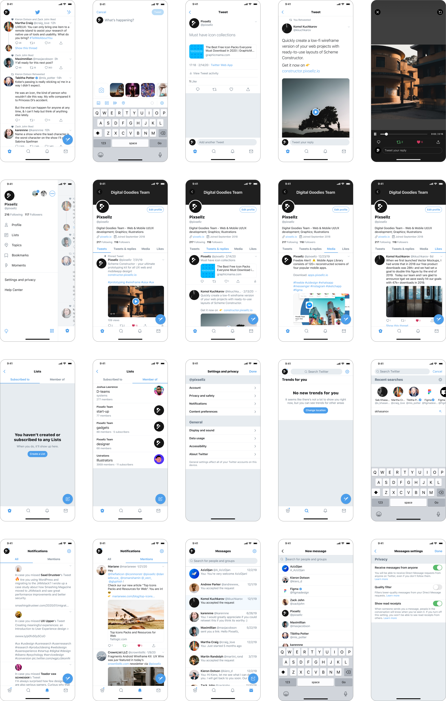

# CodTech - Task 1

- **Name:** Charankumar E G D
- **Company:** CodTech IT Solutions
- **ID:** CT08DS3885
- **Domain:** UI/UX Design
- **Duration:** July 5th, 2024 to August 5th, 2024
- **Mentor:** Neela Santhosh kumar

## Project Overview: Twitter Clone

Creating wireframes for a Twitter clone involves understanding the core features of Twitter, sketching initial layouts, designing detailed wireframes using tools like Figma, Sketch, or Adobe XD, and detailing basic UI elements.

### Objectives

- Create wireframes for a Twitter clone.
- Design screen layouts and basic UI elements.
- Use design tools like Figma, Sketch, or Adobe XD.

## Example Screens:

